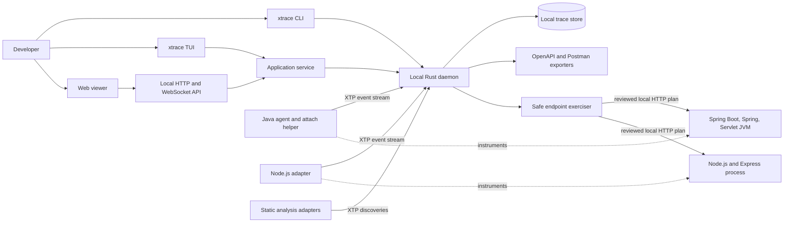
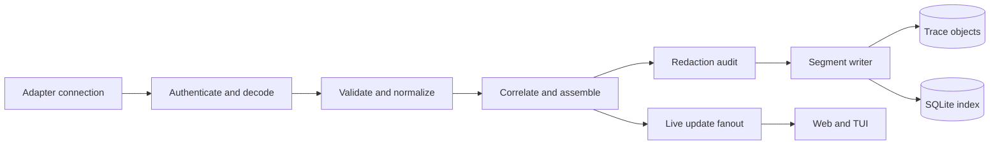

# Architecture: X-trace

**Gate:** 2, approved 2026-09-28  
**Date:** 2026-09-28  
**Scope:** system boundaries, deployment shape, protocols, data ownership, extension model, security, and technology choices. Concrete classes, functions, schemas, and tickets belong to Gate 3 and Gate 4.

## Executive decision

X-trace should be a **local-first developer tool built around a Rust daemon and out-of-process language adapters**.

- `xtrace` is one distributable CLI. It initializes a repository, starts or finds the local daemon, launches or attaches instrumentation, opens the browser viewer, runs the TUI, exports API artifacts, and requests endpoint exercises.
- `xtrace-daemon` is the single authority for project state, endpoint reconciliation, capture ingestion, storage, replay, exports, and safety policy.
- The web viewer and Rust TUI are clients of the same application model. They share commands, queries, statuses, filters, provenance, and replay semantics, but keep rendering code appropriate to each surface.
- Runtime instrumentation is implemented in the target ecosystem: a Java agent and Java attach helper, plus a Node.js preload/loader package in v1. These adapters run outside the Rust process and speak a versioned X-trace protocol.
- X-trace stores data locally and binds only to loopback by default. Redaction and value budgets are applied in the runtime adapter before data crosses the process boundary.
- A native desktop shell is not part of the first architecture. The local daemon plus browser gives the rich canvas; the Rust TUI gives an efficient terminal workflow. A desktop wrapper can be added later without changing the core.

This preserves a stable language-neutral engine while allowing each runtime integration to use the mechanisms that are safe and idiomatic for that runtime.

## System shape



### Why a local daemon

The daemon owns the long-lived capture session while terminals and browser tabs come and go. It also gives both UI surfaces one consistent truth, prevents two clients from writing the trace store independently, and provides a natural boundary for future language adapters. The daemon is not a cloud service and does not require an account.

### Why not a desktop application first

A desktop shell would add signing, auto-update, embedded-browser, and cross-platform packaging work without improving capture. The browser is the stronger surface for a Figma-like canvas and source rendering. The TUI covers terminal-first users. If distribution research later shows a desktop shell is valuable, Tauri can wrap the same daemon and web assets rather than replacing the architecture.

## Architectural boundaries

### 1. Domain

The domain is language- and UI-neutral. Its durable concepts are:

- **Project:** repository identity, source roots, revision, configuration, and privacy policy.
- **Catalog revision:** an immutable snapshot of endpoint identities and their added, changed, removed, inferred, and observed states.
- **Runtime session:** one instrumented process and its negotiated adapter capabilities.
- **Endpoint:** stable HTTP operation identity plus one or more discovery claims.
- **Path hypothesis:** a possible static call path with confidence and evidence.
- **Recording:** one observed request execution, complete or partial.
- **Frame:** a replayable source or interaction step.
- **Interaction:** database, outbound HTTP, messaging, filesystem, or framework boundary activity.
- **Value snapshot:** bounded data captured at a named observation point.
- **Source artifact:** repository-relative path, content hash, revision, and source range.
- **Run record:** an explicit scan, capture, exercise, or export requested by the user, including its inputs, policy, results, and catalog revision.
- **Provenance:** how each fact was obtained.

No Spring, Servlet, Express, browser, terminal, Byte Buddy, or React type may enter the domain package.

### 2. Application service

The application service implements use cases such as list endpoints, merge discovery claims, arm capture, select recording, read frame, compare inferred and observed paths, construct an exercise plan, approve a plan, and export artifacts. Both clients consume these semantics:

- The TUI calls the Rust application interface directly when it owns the daemon, or the same local client API when connecting to an existing daemon.
- The web application uses a generated TypeScript client for the local API.
- Contract tests run the same use-case scenarios through both the direct interface and the HTTP adapter to prevent behavioral drift.

Shared semantics do not mean shared rendering. The web maps an execution to a spatial graph or linear trace; the TUI maps it to endpoint lists, call trees, source, values, and replay controls.

### 3. Runtime adapters

Runtime adapters discover or observe facts and send them to the daemon. They never write the store directly and never define product state. An adapter may be implemented in any language if it conforms to the protocol and capability contract.

Adapters are out of process from the daemon. This avoids a Rust plugin ABI, contains crashes and dependency conflicts, and lets a Java agent remain Java while a Node adapter remains JavaScript or TypeScript.

### 4. Infrastructure

Storage, HTTP, WebSocket, process launch, attach, static scanner execution, exporters, and operating-system integration implement ports owned by the application layer. Dependency direction points inward toward the domain and application service.

## Two protocols, one model

Using one wire format for both high-volume agent events and browser queries would optimize neither. X-trace therefore has two protocols generated from one versioned schema vocabulary.

### XTP-Agent

XTP-Agent is the adapter-to-daemon protocol. It uses length-delimited Protocol Buffers over a mutually authenticated local transport. The first implementation uses loopback TCP for portability; Unix domain sockets and Windows named pipes can be added behind the same transport interface.

Message families:

- `AdapterHello` and `DaemonHello`: protocol version, adapter identity, runtime, process, project, and nonce proof.
- `CapabilitySet`: attach, retransformation, endpoint discovery, static inference, method frames, line cursor, locals, async correlation, database, outbound HTTP, and value capture.
- `EndpointClaimBatch` and `StaticPathBatch`: discovered operations and inferred edges.
- `RecordingStarted`, `EventBatch`, `RecordingFinished`: observed execution stream.
- `CapturePolicy` and `CaptureCommand`: scope, depth, sampling, redaction, and budgets.
- `Ack`, `Throttle`, `DropNotice`, and `Health`: backpressure and honest partial-capture reporting.

Every message carries protocol major/minor, session ID, monotonically increasing sequence number, and adapter timestamp. Unknown optional fields are ignored. Major mismatches fail with an actionable compatibility error; minor versions negotiate capabilities.

### XTP-Client

XTP-Client is the UI API:

- OpenAPI-described JSON HTTP for projects, endpoints, recordings, frames, source, configuration, plans, and exports.
- WebSocket events for capture progress, endpoint coverage changes, new recordings, playback availability, and daemon health.
- Generated Rust and TypeScript clients from the committed API description.

The API exposes intent-level operations such as `arm focused capture` or `approve exercise plan`; it does not expose database tables or raw agent messages.

### XTF recording format

The internal recording format is an appendable, versioned event envelope. A recording preserves:

- repository revision and dirty-source hashes;
- adapter/runtime/framework versions;
- capture and redaction policy IDs;
- ordered events with trace, parent, thread/task, and async-link identifiers;
- source locations and bounded before/after snapshots;
- explicit `redacted`, `unavailable`, `truncated`, and `dropped` markers;
- completion or partial-capture reason.

XTF is not declared a public interchange format in the first release. That lets the team evolve storage while keeping XTP and the client API stable. A later standalone export can be versioned independently.

## Evidence and provenance model

X-trace must never flatten different kinds of truth into one line. Each node and edge carries one of these provenance states:

| Provenance | Meaning | UI treatment |
|---|---|---|
| `static_inferred` | A source or bytecode analyzer believes the path is possible | Dashed edge, confidence and reason visible |
| `runtime_discovered` | A live framework registered the endpoint or handler, but it has not executed | Solid catalog entry, no execution claim |
| `observed` | An instrumented request produced the event | Solid highlighted replay path with recording identity |
| `partial_observation` | Capture began but data was dropped, unsupported, or ended early | Warning boundary at the exact gap |

Endpoint reconciliation uses a stable operation key based on normalized method, normalized route template, application component, and handler identity. Conflicting claims remain inspectable rather than being silently overwritten.

Static inference is useful before the first request, but dependency injection, reflection, proxies, generated code, polymorphism, and data-dependent branches make it uncertain. The model therefore supports alternative branches and confidence instead of presenting one invented path.

## Capture model: useful replay without pretending to be a JVM debugger

Recording every bytecode instruction and every local variable continuously would impose unacceptable overhead and generate misleading data when debug metadata is missing. X-trace uses capture tiers:

1. **Catalog capture:** endpoint mappings, handler identity, framework metadata, and static hypotheses. No request required.
2. **Standard recording:** request boundary, application-package method entry/return/throw, meaningful source-line cursor changes, arguments/returns, database calls, outbound HTTP, and exceptions. This is the default background mode.
3. **Focused deep recording:** temporarily retransforms only the selected endpoint's reachable application packages to add denser line probes and bounded local snapshots. The user or replay workflow arms this mode for the next matching request.

The UI uses the same replay controls for all tiers but only enables operations supported by the recording. A frame that lacks locals says why: compiled without a local-variable table, value excluded by policy, capture budget reached, or adapter lacks the capability.

This is a historical replay, not a suspended process. “Step into,” “step over,” and “step out” navigate recorded frames; they do not control a live thread.

## Java integration

### Artifact split

- **X-trace Java agent JAR:** Byte Buddy based transformer with `premain` and `agentmain`, an isolated/shaded agent classloader, event encoder, bounded buffer, redactor, and framework modules.
- **Java attach helper:** a small executable JAR invoked by the Rust CLI to enumerate compatible JVMs through `jdk.attach`, attach to the selected PID, and load the agent.
- **Java static analyzer:** a separate process or build task that emits endpoint claims and path hypotheses. It cannot share classes with the target application.

### Launch path

Launch-through-X-trace is the reliable path. The CLI chooses a launcher strategy for direct JARs, Maven, Gradle, application servers, or a user-supplied command, then injects the agent before application classes load. It always prints the equivalent command so the setup is understandable and reproducible.

### Attach path

Attach is first-release scope but remains best effort. The Attach API can load an agent into a running compatible JVM, and `agentmain` can install transformers and request retransformation where the JVM supports it. Limitations are surfaced as capabilities and gaps, not hidden:

- dynamic agent loading can be disabled or require an explicit JVM option;
- permissions, container boundaries, different users, or incompatible JVMs can block attach;
- already loaded or non-retransformable classes may reduce coverage;
- activity that happened before attachment cannot be reconstructed.

If attachment is not possible, X-trace gives an exact relaunch command using `-javaagent`.

### Initial Java modules

The agent boundary is framework-module based:

- Servlet API request/response and async dispatch;
- Spring MVC handler registration and invocation;
- Spring WebFlux routing and reactive-context correlation;
- application package method and source probes;
- JDBC and selected outbound HTTP clients;
- exception and thread/async context propagation.

Spring Boot Actuator mappings may be consumed when exposed, but the product must not require Actuator or change the application's endpoint exposure. Framework instrumentation remains the authoritative runtime discovery path.

The agent may interoperate with an existing OpenTelemetry context and may ingest OTLP spans, but X-trace does not make the OpenTelemetry Java agent its core. Standard telemetry spans do not contain enough line, value, provenance, and replay information for the product, while forking the full agent distribution would create a large maintenance surface before the product contract is proven.

## Node.js and future runtimes

Node.js is a v1 runtime, not a later proof of concept. It validates the extension boundary without reshaping the core:

- a `--require` preload for CommonJS and a `--import` registration module for ESM;
- Node module customization hooks for focused transformation of application-owned source, with source-map composition for TypeScript and transpiled JavaScript;
- `AsyncLocalStorage` correlation across callbacks and promise chains;
- Node HTTP/HTTPS boundaries plus Express, Fastify, NestJS, database, outbound request, async context, and application-function events;
- the same XTP capability negotiation and event vocabulary;
- JavaScript-specific source locations and values kept behind adapter normalization.

Framework instrumentation is registered before application modules load. Express route-registration and middleware hooks, Fastify route/lifecycle hooks, and NestJS integration through its selected HTTP adapter produce framework-neutral endpoint claims and frames. Existing OpenTelemetry context can be correlated, but telemetry spans do not replace X-trace's source/value events.

Standard Node capture uses framework and function boundaries. Focused deep capture transforms only application-owned modules as they load and inserts bounded line/value probes. It is development/test functionality, never applied to `node_modules`, and is unavailable when a bundler or late attachment prevents safe source transformation. The Node Inspector protocol is not used to pause a production-like event loop.

Bundled applications, late instrumentation initialization, CommonJS/ESM differences, worker threads, and transpiled source maps are adapter capabilities and diagnostics. They do not become special cases in the domain. Runtime attachment for Node is not promised in v1; launch-through-X-trace is required for complete capture.

### V1 language and framework scope

Support is declared per **language + runtime range + framework + framework range + capability**, never by a vague “supports Java” or “supports Node” badge.

| Language | Framework boundary | V1 target | Notes |
|---|---|---|---|
| Java | Spring Boot with Spring MVC | Supported | Discovery, attach/launch, standard and focused capture |
| Java | Spring Framework MVC without Boot | Supported | Build and deployment setup may require an explicit launch command |
| Java | Spring WebFlux | Supported | Reactive context correlation is a release gate |
| Java | `javax.servlet` and `jakarta.servlet` applications | Supported | Container-specific compatibility is published separately |
| Node.js | Built-in HTTP/HTTPS | Supported | Foundation for framework adapters |
| Node.js | Express | Supported | Route, middleware, handler, outbound and data interactions |
| Node.js | Fastify | Supported | Follow public route and lifecycle hooks; do not depend on removed community instrumentation |
| Node.js | NestJS on Express or Fastify | Supported | Nest controller identity plus underlying adapter events |
| Node.js | Koa | Preview | Promoted only after the same conformance and overhead gates pass |

“Supported” means endpoint discovery, observed request correlation, source navigation, exceptions, privacy enforcement, exports, compatibility fixtures, and documented gaps. Focused line/value capture is capability-graded separately because build output and debug metadata differ.

### Future language package contract

Each language ships as a versioned **language pack** containing:

- an adapter manifest with language/runtime ranges, framework modules, capture modes, attach/launch support, and known limitations;
- runtime instrumentation and static-discovery executables or packages;
- generated XTP bindings;
- golden protocol fixtures and end-to-end sample applications;
- redaction and overhead tests;
- a signed package identity and compatibility declaration.

Python can map WSGI/ASGI plus Django, Flask, and FastAPI; Ruby can map Rack plus Rails; Rust can map Hyper/Tower plus Axum, Actix Web, and Rocket; Go can map `net/http` plus framework middleware. These examples do not enter the core domain. The daemon only sees capabilities, endpoint claims, recordings, frames, source artifacts, and interactions.

A new language integration is accepted only when it can provide an adapter manifest, protocol conformance suite, capability matrix, fixture application, privacy tests, and compatibility policy.

## Ingestion, backpressure, and failure honesty

The daemon pipeline follows a source-transform-sink topology:



Each boundary uses a bounded channel. If the daemon cannot keep up, it sends a throttle request. The agent reduces optional detail first, then drops low-priority line/value events before request boundaries, errors, or completion markers. Every loss produces a `DropNotice` stored in the recording. Application request threads never block indefinitely on the recorder.

A crash during capture leaves recoverable segments and marks the recording partial on the next daemon start. The daemon owns migrations and takes a backup before any destructive store migration.

## Storage

Default project state lives in a user-data directory keyed by the canonical repository identity, not in committed source. A small `.xtrace/config.toml` may be created in the repository only through `xtrace init`.

- **Bundled SQLite in WAL mode:** project metadata, catalog revisions, endpoints, claims, runs, recordings, frame indexes, source manifests, policies, export metadata, and schema migrations. The Rust binary links or packages SQLite, so the user never needs to find, install, or administer a system SQLite executable.
- **Immutable compressed objects:** length-delimited XTF event segments and optional source snapshots, content-addressed and compressed with Zstandard.
- **Repository source:** read live only when its hash matches the recording manifest. If it differs, the UI warns and uses a captured source excerpt when policy allowed one.

The split keeps list/filter queries simple while avoiding one huge mutable event table. Retention is policy driven by total bytes, age, and recordings per endpoint. Deletion is recoverable only if the operating system trash integration is available; otherwise X-trace clearly states that local trace deletion is permanent.

### Local history and explicit runs

The daemon may stay available, but work is performed only through an explicit user action:

- `scan` creates a new catalog revision and computes endpoint additions, changes, removals, and provenance changes against the previous revision;
- `run` or `attach` starts a bounded capture session and records its configuration and source revision;
- `exercise` first creates a reviewable plan, then creates a run only after approval;
- `export` records the catalog revision and sanitization policy that produced the artifacts.

No scheduled rescans, endpoint exercises, Postman uploads, or network requests occur by default. When the user requests another exercise run, the default selection is **new, changed, and never-observed endpoints**; “all endpoints” and custom selections remain explicit options. Previous runs and recordings are immutable, so the UI can compare what changed across repository revisions without rewriting history.

## Web and TUI surfaces

### Web

The daemon serves version-matched static web assets on a random loopback port. The three stable regions are:

1. endpoint and scenario context;
2. execution navigation, switchable between Canvas and Linear views;
3. code evidence with the active line, values at that observation point, value changes, provenance, and gaps.

Both execution views project the same selected recording and frame. Switching views never resets the selection, timeline, filters, or playback state. React with TypeScript is appropriate for the web client; React Flow is a candidate for the graph surface and CodeMirror 6 is a candidate for read-only source rendering. These remain replaceable UI adapters rather than domain dependencies.

In Linear mode, source code becomes the central workspace rather than a small inspector. Playback moves a visible execution cursor between files and lines; values are attached to the exact observation line, with before/after changes, unavailable/redacted markers, and the frame result nearby. The right rail becomes a compact execution stack and value inspector. Canvas mode keeps the graph central and uses the right pane for synchronized source evidence.

### TUI

The TUI is implemented in Rust with Ratatui. It provides endpoint search, status, recordings, a linear call tree, source, values, gaps, plan approval, catalog/run history, and export actions. It does not attempt to reproduce freeform canvas panning in terminal cells. `xtrace tui` connects to an existing daemon or starts an embedded local session using the same application service.

### CLI

The CLI remains scriptable and non-interactive when flags are complete. Interactive process selection, safety confirmation, or authentication prompts are explicit fallbacks. Machine-readable output is available for CI and editor integrations.

## Automated endpoint exercising

The exerciser is a Rust application service, separate from runtime instrumentation. It builds request candidates from OpenAPI, runtime endpoint metadata, static types, recorded examples, and user-supplied scenario files. It does not invent credentials or silently send requests.

Safety policy:

- explicit user request is required to create and run a plan;
- the plan lists base URL, method, path, inputs, authentication source, expected effect class, and endpoints in scope;
- loopback targets are the default; non-loopback targets require an explicit override;
- `GET`, `HEAD`, and `OPTIONS` may be batch-approved;
- `POST`, `PUT`, `PATCH`, and `DELETE` require mutation confirmation unless the user configured an ephemeral test environment policy;
- secrets stay in memory or an OS credential store and are replaced in recordings and exports;
- rate, concurrency, timeout, and maximum-response budgets are mandatory;
- each generated recording is tagged with its exercise plan and input provenance.

“Run all endpoints” therefore means “prepare and approve a bounded plan,” not “blindly fire every route.”

## OpenAPI and Postman export

Export is a projection of the reconciled endpoint catalog:

- OpenAPI 3.1 contains operations, available schemas, security requirements, and sanitized observed examples.
- Vendor extensions preserve X-trace provenance and recording references without claiming inferred examples were observed.
- Postman Collection v2.1 is generated directly for predictable folders, requests, variables, and examples. The OpenAPI export is also importable by Postman.
- Authentication values, cookies, tokens, and configured secret fields are never exported.
- A cURL export creates one readable command per endpoint plus an `all.sh` index. Values that require secrets or user input remain named placeholders. Mutating commands are never executed by export.

Exports are deterministic for a project revision and policy, making them reviewable in Git when a team chooses to commit them.

Both web and TUI expose the same export menu: **OpenAPI**, **Postman**, **cURL recipes**, and **Developer bundle**. “Open in Postman” is an explicit connected action: after the user provides a Postman API key and chooses a workspace, X-trace previews the sanitized collection, creates or updates it through the official Postman API, and asks the operating system to open the returned collection URL. If the installed Postman application handles that official URL it opens there; otherwise the collection opens in Postman Web, already loaded. Without a Postman connection, the action exports a local Collection v2.1 file and explains how to import it. X-trace does not rely on an undocumented desktop URL scheme and never uploads automatically.

## Security and privacy

- Bind to `127.0.0.1` and `::1` only by default. Remote binding is a future explicit mode.
- Generate a per-daemon secret. Browser bootstrap uses a one-time fragment token exchanged for a same-site, HTTP-only session cookie so credentials do not enter URL logs.
- Validate `Origin` and host headers; disallow wildcard CORS.
- Authenticate adapter handshakes with a session nonce inherited through launch configuration or an owner-readable file for attach.
- Apply secret-name rules, header rules, depth limits, collection limits, string limits, object-count limits, and total recording budgets in the agent before transport.
- Represent redaction explicitly so the UI never confuses redacted with empty.
- Store data in an owner-only directory and provide `xtrace purge`, retention previews, and per-project exclusion rules.
- Store an optional Postman API key only in the operating-system credential store; persist only the selected workspace and collection identifiers in X-trace metadata.
- Disable product telemetry by default. Diagnostic logs contain IDs and counts, not captured values.
- Treat source files, build files, annotations, recorded values, and imported specs as untrusted data, never as executable instructions to X-trace.

## Packaging and lifecycle

The desired user installation is one signed `xtrace` package per platform containing:

- Rust CLI, daemon, and TUI;
- version-matched web assets;
- Java agent and attach helper;
- Node.js preload/loader adapter and framework modules;
- protocol schemas and migration metadata.

Runtime adapter versions are pinned to the CLI release but negotiate compatibility with the daemon. The daemon uses a project lock and discovery file so repeated `xtrace open`, `xtrace tui`, and `xtrace status` reuse it. A clean shutdown flushes segments; stale discovery files are validated against PID and nonce before reuse.

Updates never silently rewrite repository configuration. Store schema migrations are forward only, versioned, backed up, and tested against fixtures from every released schema.

## Repository shape and dependency direction

```text
x-trace/
  crates/
    xtrace-domain/       # entities, provenance, replay semantics
    xtrace-application/  # use cases and ports
    xtrace-protocol/     # generated XTP and API types
    xtrace-ingest/       # validation, correlation, backpressure
    xtrace-store/        # SQLite and object store adapters
    xtrace-daemon/       # lifecycle, HTTP, WebSocket, adapter server
    xtrace-cli/          # command surface
    xtrace-tui/          # Ratatui client
    xtrace-export/       # OpenAPI and Postman projections
    xtrace-testkit/      # conformance and fixture support
  agents/
    java/
      agent/
      attach-helper/
      modules/
      static-analyzer/
    node/
      loader/
      modules/
      static-analyzer/
  schema/
    proto/
    openapi/
    fixtures/
  web/
  examples/
    java-spring-boot/
    java-spring/
    java-servlet/
  docs/
```

Allowed dependency direction:

```text
UI / CLI / adapters -> application ports and generated protocol -> domain
daemon infrastructure -> application ports -> domain
domain -> Rust standard library plus narrowly approved foundational crates
```

The Java and Node builds do not depend on Rust source. They depend on generated protocol artifacts and conformance fixtures. Generated files are reproducible and checked for drift in CI.

## Technology baseline

The implementation plan may change individual libraries only through an architecture decision record, but the baseline is:

| Area | Baseline | Reason |
|---|---|---|
| Rust async and lifecycle | Tokio | Mature process, network, channel, and cancellation primitives |
| Local HTTP and WebSocket | Axum | Small typed layer over Tokio and Tower; application semantics remain outside handlers |
| Agent messages | Protocol Buffers generated with Prost | Compact cross-language schema with compatibility tooling |
| Store | Bundled SQLite through a dedicated store adapter and serialized writer | Portable, inspectable, transactional local metadata with no user-managed installation |
| Trace compression | Zstandard | Fast local compression for immutable segments |
| CLI | Clap | Typed commands and generated help |
| TUI | Ratatui plus Crossterm | Portable Rust terminal UI with a modular architecture |
| Web | React and strict TypeScript | Strong ecosystem for graph and source experiences |
| Canvas | React Flow candidate | Mature node/edge interaction, minimap, zoom, and custom rendering |
| Source viewer | CodeMirror 6 candidate | Read-only source decorations and inline value widgets without shipping a full IDE |
| Java transformation | Byte Buddy | Mature agent builder and retransformation support |
| Java protocol runtime | Shaded minimal protobuf runtime | Avoid application dependency conflicts and control agent size |
| Node adapter | Strict TypeScript compiled to versioned CommonJS and ESM entrypoints | Support both module systems while keeping one adapter implementation |
| Build entrypoint | Root task runner over Cargo, Gradle Wrapper, and pnpm | One discoverable command surface while each ecosystem keeps its native build |

Exact versions, minimum supported Rust version, target JDK matrix, and browser support are Gate 3 decisions backed by compatibility fixtures.

## Coding and repository standards from day one

These are release gates, not cleanup tasks:

- **Rust:** pinned toolchain; Rust 2024 edition; `rustfmt`; workspace Clippy with warnings denied; `unsafe_code` forbidden by default and allowed only in a separately audited module; typed domain errors; no transport or database errors escaping infrastructure adapters; `cargo nextest`, dependency advisories, license policy, and unused-dependency checks in CI.
- **Java:** Gradle Wrapper with Kotlin DSL; reproducible dependency locking; formatter plus static analysis; explicit nullability; no wildcard imports; agent code tested against a declared JDK/framework matrix; Byte Buddy advice tests and real forked-JVM fixtures; shaded dependency collision tests.
- **Node adapter:** strict TypeScript; separate CommonJS and ESM fixtures; public-hook-first framework integrations; source-map round-trip tests; no transformation of dependencies; worker-thread and async-context tests; no use of undocumented framework internals without a quarantined compatibility module.
- **TypeScript:** strict mode including unchecked-index and exact-optional-property checks; formatter and linter with zero warnings; no handwritten copies of generated protocol types; accessibility and keyboard tests for replay controls.
- **Schemas:** one source of truth; lint and breaking-change checks for Protobuf and OpenAPI; golden cross-language fixtures; generated code drift fails CI.
- **Tests:** unit tests at domain boundaries, property tests for event ordering and reconciliation, snapshot/golden tests for protocol and export formats, integration tests with real sample apps, crash-recovery tests, and end-to-end browser/TUI journeys.
- **Dependencies:** lockfiles committed; automated advisory and license checks; an SBOM for releases; no copyleft or source-available dependency enters a distributable without an explicit legal and architecture review.
- **Changes:** conventional commit categories, a changelog fragment for user-visible or protocol changes, architecture decision records for boundary changes, and mandatory migration/compatibility notes for persisted or wire schema changes.
- **Privacy:** tests seed recognizable secrets and fail if they appear in stored events, logs, HTTP responses, OpenAPI, or Postman exports.
- **Performance:** repeatable overhead fixtures for idle agent, standard capture, focused capture, ingestion saturation, replay latency, and store growth. A feature cannot ship without budgets defined in Gate 3.

## Architecture fitness rules

These constraints become automated checks in Gate 3:

- domain crates cannot import transport, database, UI, framework, or runtime-agent packages;
- protocol compatibility is tested with golden messages from Rust, Java, and Node;
- every persisted fact has provenance;
- every value type supports unavailable, redacted, truncated, and dropped states;
- agent queues are bounded and cannot block application threads indefinitely;
- no UI reaches SQLite or raw trace objects directly;
- every adapter publishes capabilities and passes the conformance suite;
- exports contain no values that fail the active redaction policy;
- static hypotheses can never be converted to observed frames without a recording ID;
- TUI and web command/query behavior passes shared application scenarios.

## Alternatives considered

| Alternative | Decision | Reason |
|---|---|---|
| Entire product in Java | Rejected | Excellent for the first agent, but couples the engine to one runtime and weakens the Node path |
| Rust core with in-process native plugins | Rejected for v1 | Rust has no stable plugin ABI; a faulty adapter could crash or compromise the daemon |
| TUI-only application | Rejected | Cannot deliver the requested spatial canvas and synchronized rich source view |
| Native desktop first | Deferred | Adds packaging complexity; browser plus TUI already covers the two primary workflows |
| OpenTelemetry/OTLP as the only protocol | Rejected | Strong for spans, but insufficient for source frames, value states, static provenance, capabilities, and replay controls |
| Debug Adapter Protocol as the product protocol | Rejected | DAP is designed for controlling live debuggers; X-trace replays historical evidence and has discovery/capture concerns DAP does not model |
| Fork OpenTelemetry Java agent | Deferred | Valuable instrumentation coverage but a large maintenance surface before line/value replay is proven |
| All events as normalized SQLite rows | Rejected | Simple initially but expensive for dense append-only event streams and schema evolution |
| Browser reads trace files directly | Rejected | Duplicates parsing and policy logic, weakens migrations, and makes TUI/web consistency harder |

## Reference repositories and reuse posture

| Reference | What X-trace learns | Reuse posture |
|---|---|---|
| [Microsoft Debug Adapter Protocol](https://github.com/microsoft/debug-adapter-protocol) | One language-neutral UI protocol with runtime-specific adapters and negotiated capabilities | Architectural analogy only; DAP messages are not reused |
| [Oracle Java Instrumentation API](https://docs.oracle.com/en/java/javase/21/docs/api/java.instrument/java/lang/instrument/package-summary.html) and [Attach API](https://docs.oracle.com/en/java/javase/21/docs/api/jdk.attach/com/sun/tools/attach/package-summary.html) | `premain`, `agentmain`, retransformation capabilities, and the limits of runtime attach | Normative JVM integration APIs; test actual supported JDKs rather than assuming uniform attach behavior |
| [Spring Boot mappings endpoint](https://docs.spring.io/spring-boot/api/rest/actuator/mappings.html) | Runtime handler mapping vocabulary and useful discovery fallback | Optional input only; X-trace never requires exposing Actuator |
| [OpenTelemetry Protocol](https://github.com/open-telemetry/opentelemetry-proto/blob/main/docs/specification.md) | Language-neutral Protobuf, transport separation, partial success, retry and throttling semantics | Reuse semantic conventions and optional OTLP interop; custom replay protocol remains separate |
| [OpenTelemetry Java Instrumentation](https://github.com/open-telemetry/opentelemetry-java-instrumentation) | Agent classloader isolation, Byte Buddy instrumentation modules, framework compatibility testing | Study and possibly depend on narrow APIs; do not fork the distribution in v1 |
| [Byte Buddy](https://github.com/raphw/byte-buddy) | Mature Java agent construction and retransformation | Direct Apache-2.0 dependency candidate |
| [AppMap specification](https://github.com/getappmap/appmap) | Runtime call/return events, HTTP and SQL events, source locations, value sanitization provenance | Schema inspiration and possible later importer; verify exact license before code/schema reuse |
| [Vector](https://github.com/vectordotdev/vector/blob/master/docs/ARCHITECTURE.md) | Rust source-transform-sink topology, bounded channels, buffering, backpressure, health checks | Architecture reference only; MPL-2.0 code is not copied |
| [Helix](https://github.com/helix-editor/helix/blob/master/docs/architecture.md) | Rust separation of core, view, events, DAP client, and terminal UI | Architecture reference only; MPL-2.0 code is not copied |
| [Ratatui](https://github.com/ratatui/ratatui/blob/main/ARCHITECTURE.md) | Modular Rust TUI core/widgets/backend design | Direct MIT dependency candidate |
| [Node.js module customization hooks](https://nodejs.org/api/module.html#customization-hooks) and [AsyncLocalStorage](https://nodejs.org/api/async_context.html) | Pre-application loading hooks, source-map support, and stable request-context propagation across asynchronous work | Normative Node integration APIs; publish a runtime compatibility matrix because hook maturity varies by Node version |
| [OpenTelemetry JS Contrib](https://github.com/open-telemetry/opentelemetry-js-contrib) | Express, NestJS, Koa, database and outbound auto-instrumentation boundaries, package ownership, and compatibility discipline | Apache-2.0 reference and selective dependency candidate; re-evaluate each framework package independently |
| [Fastify OpenTelemetry](https://github.com/fastify/otel) | Public Fastify route/lifecycle instrumentation maintained with the framework | MIT reference and selective dependency candidate; prefer it over the removed contrib Fastify instrumentation |
| [React Flow / xyflow](https://github.com/xyflow/xyflow) | Customizable node canvas, controls, minimap, and graph interaction | Direct MIT dependency candidate; preserve required notices and decide attribution policy before release |
| [Sentry Relay](https://github.com/getsentry/relay) | Rust ingestion, normalization, protocol validation, and PII scrubbing discipline | Architecture reference only; FSL means no code reuse without legal review |
| [Postman OpenAPI import](https://learning.postman.com/docs/getting-started/importing-and-exporting/importing-data) and [Create Collection API](https://learning.postman.com/api-docs/api-reference/collections/create-collection) | OpenAPI imports can become collections; the authenticated API can create a Collection v2.1 in a chosen workspace | Generate local artifacts by default; connected upload/open is explicit and credentialed |

## Gate 2 acceptance decisions

Approval of this gate accepts these architecture commitments:

1. Rust local daemon, CLI, and TUI; browser-based web viewer; no native desktop shell in the first release.
2. Out-of-process, runtime-native instrumentation adapters behind a versioned protocol.
3. Java and Node.js are both v1 language packs. Java covers Spring Boot, Spring MVC/WebFlux and Servlet; Node covers built-in HTTP, Express, Fastify and NestJS, with Koa preview.
4. Separate high-volume XTP-Agent and client-friendly XTP-Client protocols over one domain vocabulary.
5. Standard background capture plus opt-in focused deep capture for denser line and value replay.
6. Evidence provenance is mandatory and visible at the data-model level.
7. Bundled SQLite metadata plus immutable compressed trace objects for local storage; the user installs no separate database.
8. Explicit-plan endpoint exercising with loopback, mutation, credential, and budget safeguards.
9. TUI and web share application semantics, not rendering code.
10. Local catalog revisions and immutable run records track endpoint changes over time; exercise runs happen only after an explicit request and approval.
11. OpenAPI 3.1, Postman Collection v2.1 and cURL recipes are deterministic export projections, with an optional explicit Postman API connection.
