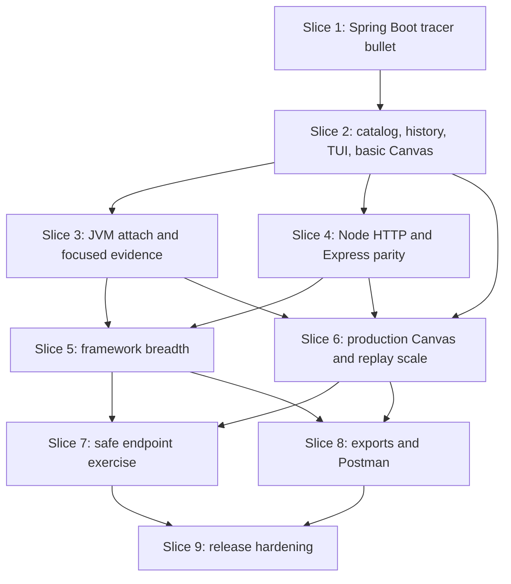

# Visible Vertical Slices: X-trace

**Gate:** 4, approved 2026-09-28  
**Date:** 2026-09-28  
**Depends on:** approved Product, Architecture, and Program Design gates  
**Scope:** implementation order, dependency graph, slice boundaries, user-visible outcomes, acceptance evidence, integration checkpoints, and release gates.

Implementation starts only after this gate is approved.

## 1. What a slice means

A slice is not “finish a crate,” “build the database,” or “make the UI.” Every slice must end with a runnable developer journey crossing the necessary layers:

```text
real sample application
-> runtime adapter
-> XTP-Agent
-> Rust ingestion/domain/storage
-> XTP-Client
-> browser and/or TUI
-> observable user outcome
```

Scaffolding is allowed only when it is required by the slice. A green unit test without a real packaged journey does not complete a slice.

Each slice has:

- one primary user-visible promise;
- exact scope and non-goals;
- real Java or Node fixture applications;
- failure/privacy behavior;
- automated contracts;
- an owner-verifiable demo;
- durable evidence recorded against an exact commit and packaged build.

## 2. Global definition of done

Every slice must satisfy all applicable items before the next dependent slice begins:

1. The primary journey works from the packaged `xtrace` command, not only from an IDE or test harness.
2. The result is visible in the actual web/TUI surface named by the slice.
3. The test uses a real framework application and real request; no mocked adapter may satisfy an end-to-end gate.
4. Persisted and wire changes match the approved Gate 3 contracts or include an approved ADR/Gate 3 amendment.
5. Provenance, gaps, redaction, and unsupported capabilities are represented honestly.
6. Format, lint, unit, integration, conformance, privacy, and relevant journey tests pass with zero ignored failures.
7. Failure-path tests accompany the happy path.
8. No captured secret can be found in diagnostics, SQLite, trace objects, client responses, browser state, snapshots, or exports.
9. The slice documents commands used, fixture versions, platform, build identity, and known limitations.
10. A fresh-machine/profile run proves installation and bootstrap changes when packaging is affected.

## 3. Evidence package per slice

Each completed slice writes a release-evidence directory:

```text
evidence/slice-N/
  manifest.json            # commit, build hashes, platform, runtime/framework versions
  commands.md              # exact reproducible commands
  tests.json               # suites, counts, duration, failures/skips
  journey.md               # expected and observed user journey
  screenshots/             # relevant web/TUI views
  diagnostics/             # sanitized doctor output
  performance.json         # only applicable budgets
  privacy-scan.json         # seeded-canary scan result
  known-gaps.md
```

Evidence contains no source/value payloads beyond synthetic fixture data. A slice is “implemented” only after evidence is reviewed against its exit criteria.

## 4. Dependency map



Slices 3, 4, and the early UI work of Slice 6 can proceed in parallel after Slice 2, but shared schemas, migrations, application commands, generated clients, and replay semantics remain centrally owned and merged in a controlled order.

## 5. Slice 1 — One real Spring Boot request from launch to Linear replay

### User-visible promise

A developer can run a real Spring Boot application through X-trace, send `POST /orders`, and replay the observed controller-to-outcome path in the browser's code-first Linear mode.

### Demonstration

```text
xtrace init examples/java-spring-boot
xtrace run -- ./gradlew bootRun
curl -X POST http://127.0.0.1:8080/orders ...
xtrace open
```

The browser shows:

- `POST /orders` as observed;
- one completed recording;
- controller, service, repository, and H2/JDBC interaction frames;
- source file and active line for each navigable frame;
- previous/next/into/over/out and play/pause;
- sanitized request values and final `201` result;
- a recording/runtime/capability identity.

### Included

- Initial Rust workspace, pinned toolchains, root commands, CI skeleton, dependency/license policy.
- Minimal approved domain types: project, operation, runtime session, recording, frame, interaction, source artifact, captured value, provenance.
- Minimal XTP-Agent handshake and `RecordingStarted`, frame/interaction batch, `RecordingFinished`, ACK, health, and protocol error.
- Rust daemon lifecycle, loopback auth, adapter connection, recording assembler, one SQLite writer, XTF segment writer, and recording queries.
- `xtrace init`, `run`, `open`, `status`, and `recording show`.
- Java `premain`, Spring MVC request/handler capture, configured application-method frames, JDBC boundary, context propagation, bounded queue, sanitization, and transport.
- Browser shell, endpoint/scenario region, central Linear source view, execution rail, inline values, and playback.
- Deterministic sample app and synthetic secret canaries.

### Explicit non-goals

- Static inferred catalog before launch.
- JVM attach.
- Focused line/local-variable transformation.
- WebFlux or non-Boot Spring/Servlet compatibility claims.
- TUI replay, Canvas mode, Node.js, exercising, exports, Postman.
- Production packaging/signing or a broad compatibility claim.

### Failure and privacy cases

- Daemon unavailable, occupied port, invalid bootstrap, adapter disconnect, malformed event, missing source file, and request exception.
- Authorization/cookie/password fixture values must be redacted before transport.
- An interrupted recording reopens as partial after daemon restart.

### Automated acceptance

- Rust domain/recording state tests and store crash test at initial segment boundaries.
- Java advice tests and a forked JDK 17/21 Spring Boot fixture journey.
- Rust/Java Protobuf golden round-trip.
- Browser test steps the six-frame recording and confirms source/value synchronization.
- Privacy scan proves seeded secrets absent from wire capture, object store, database, logs, and browser payloads.

### Exit evidence

- Fresh checkout bootstrap and packaged local binary run.
- Video or ordered screenshots of command, request, endpoint, and Linear replay.
- Trace manifest showing real Java events rather than fixture-injected database rows.
- Known-gaps list visible from the UI.

## 6. Slice 2 — Inferred catalog, durable history, basic Canvas, and TUI replay

### User-visible promise

Before any request is made, a developer can scan the repository and see clearly labelled inferred endpoints/paths. After recordings occur, X-trace preserves catalog revisions and scenarios across restarts, and the same recording is inspectable in web Canvas/Linear and TUI.

### Demonstration

1. `xtrace scan` on the Spring Boot fixture before launch.
2. Web/TUI show `/orders`, `/orders/{id}`, and `/health` as inferred/discovered—not observed.
3. Change one route and add one endpoint; scan again.
4. Compare catalog revisions: added, changed, removed, and unchanged.
5. Launch, request one endpoint twice with different sanitized scenarios, restart X-trace, and replay both.
6. Switch Canvas/Linear on the same frame without losing selection.

### Included

- Stable operation/version/claim identity and catalog reconciliation.
- Java static analyzer for initial Spring MVC annotations and bounded application call hypotheses.
- Runtime endpoint discovery and claim conflict display.
- Run records and catalog revisions with complete/incomplete scan semantics.
- Multiple immutable recordings per operation and restart recovery.
- Source revision/hash matching and recorded-excerpt fallback where policy permits.
- Basic Canvas graph from observed frames plus dashed inferred alternatives.
- Ratatui endpoint list, run/catalog history, recording selection, linear frame tree, source, values, gaps, and playback.
- Shared application scenarios tested through direct and HTTP clients.

### Explicit non-goals

- Polished large-graph layout or advanced collapse/grouping.
- JVM attach and focused locals.
- Broad framework matrix or Node support.
- Exercise and exports.

### Failure and privacy cases

- Partial scans cannot mark missing operations removed.
- Conflicting static/runtime claims remain inspectable.
- Source hash mismatch cannot highlight live source as recorded truth.
- Corrupt/unreferenced objects are quarantined during recovery.

### Automated acceptance

- Property tests for normalization, reconciliation order independence, route changes, and complete/incomplete removal.
- Migration fixture from Slice 1 schema.
- Restart/crash tests with multiple recordings and catalog revisions.
- Browser test preserves selected `FrameId` between Canvas and Linear.
- TUI pseudo-terminal tests at 80x24, 120x40, reconnect, and resize.
- Web and TUI shared-contract suite returns equivalent operation/recording/navigation results.

### Exit evidence

- Before/after scan comparison.
- Side-by-side Canvas, Linear, and TUI views of the same recording/frame ID.
- Restart proof showing identical immutable recording hashes.

## 7. Slice 3 — JVM attach, focused capture, values, and failure honesty

### User-visible promise

A developer can attach X-trace to a compatible running JVM, see exact coverage limitations, arm focused capture for the next matching endpoint request, and replay denser line/value evidence without pausing the application.

### Demonstration

1. Start the Spring Boot fixture normally.
2. Run `xtrace attach`, select the validated JVM, and inspect negotiated capabilities.
3. Arm focused capture for `POST /orders` for one request.
4. Send the request and replay line movement, bounded locals/arguments/results, value changes, SQL/outbound interactions, and an exception scenario.
5. Repeat with dynamic attach disabled and receive the exact relaunch command.

### Included

- Java attach-helper list/inspect/attach commands and PID/start-time validation.
- `agentmain`, loaded-class enumeration, bounded retransformation, and per-module coverage reporting.
- Capability negotiation and visible Supported/Unavailable/Reduced states.
- Focused-capture arm/disarm/expiry state and scoped capture command.
- Application-owned line probes and local-variable capture when bytecode metadata permits.
- Captured/redacted/truncated/unavailable/dropped value states in web and TUI.
- Exceptions, gaps, sequence loss, retransmission window, throttle ladder, and partial recording finalization.
- JDBC and initial supported outbound client interaction evidence.

### Explicit non-goals

- Guaranteed attach to every JVM/container/user boundary.
- Reconstructing activity before attachment.
- Live process stepping, breakpoints, expression evaluation, or mutation.
- Native-image instrumentation.

### Failure and privacy cases

- Attach forbidden, different user, container boundary, unmodifiable classes, absent LocalVariableTable, transformer verification failure, buffer saturation, and daemon disconnect.
- Focused capture cannot broaden beyond approved packages/endpoint/count/expiry.
- Arbitrary application `toString()` is never invoked for value capture by default.

### Automated acceptance

- Attach fixture matrix on JDK 17/21/25 where the host supports attach.
- Relaunch-remediation fixtures for disabled/blocked attach.
- Byte Buddy verifier, retransformation, recursive call, exception, and local-table-absent fixtures.
- Backpressure stress proves structural events survive before optional values and produces exact drop notices.
- Privacy canaries include getters, proxies, large/cyclic objects, SQL parameters, headers, and exception messages.

### Exit evidence

- Successful attach and focused replay from a process not launched by X-trace.
- Reduced-capability and blocked-attach journeys with truthful UI/CLI messages.
- Measured request-thread enqueue and standard/focused overhead for the fixture.

## 8. Slice 4 — Node HTTP and Express parity across CommonJS and ESM

### User-visible promise

The same X-trace installation can launch Node.js HTTP/Express applications, discover endpoints, record asynchronous request flows, and replay authored JavaScript/TypeScript source through the same web and TUI semantics.

### Demonstration

1. Scan and launch CommonJS Express and ESM/TypeScript Express fixtures.
2. Send success, validation error, async service, database, and outbound requests.
3. Replay the same normalized frame/value/interaction model used by Java.
4. Arm focused capture before launch/next module load and replay authored source through composed source maps.

### Included

- Signed Node language-pack manifest and protocol bindings.
- CommonJS `--require` and ESM `--import` startup paths.
- Node HTTP/HTTPS roots, Express registration/middleware/handler/error capture.
- `AsyncLocalStorage` context, bounded queue, transport worker, redaction, ACK/throttle/drop behavior.
- JavaScript/TypeScript source locations and source-map composition.
- Static Express route analysis with confidence/reason codes.
- Focused probes for repository-owned modules loaded through X-trace.
- Database/outbound modules selected for the fixture and capability manifest.
- No Java/Node conditionals in domain, store, replay API, or client state.

### Explicit non-goals

- Late attachment to an already-running Node process.
- Rewriting `node_modules`, bundles, eval code, or modules already loaded before focused capture.
- Fastify, NestJS, or Koa compatibility claims.

### Failure and privacy cases

- Late adapter initialization, broken async context, missing/invalid source maps, worker-thread failure, unsupported loader hooks, transpiled/bundled output, and module transform parse failure.
- Getters, proxies, custom inspection, streams, Buffers, environment, headers, bodies, and errors obey safe value rules.

### Automated acceptance

- Node 22/24 LTS fixtures for CommonJS, ESM, and TypeScript/source maps.
- Rust/Node protocol goldens and the common adapter conformance suite.
- Async promise/callback, worker/child-process linkage, exception, DB/outbound, throttle, and restart tests.
- Browser/TUI client tests replay Java and Node recordings through identical query/navigation fixtures.

### Exit evidence

- One Java and one Node recording shown in the same catalog and UI with language-neutral controls.
- Source-map round-trip proof from emitted JavaScript to authored TypeScript.
- Unsupported late/bundled case shown as a capability gap rather than a false trace.

## 9. Slice 5 — Java and Node framework breadth with compatibility evidence

### User-visible promise

X-trace works across the promised v1 Java and Node framework families, and every support badge is backed by an inspectable version/capability receipt.

### Included

Java:

- Spring MVC without Boot.
- Spring WebFlux with Reactor context correlation.
- `javax.servlet` and `jakarta.servlet` request/async dispatch.
- Representative embedded and external-container fixtures.
- JDBC and selected outbound-client coverage across supported framework lanes.

Node:

- Built-in HTTP/HTTPS.
- Fastify public route/lifecycle hooks.
- NestJS on Express and Fastify with controller identity and no duplicate HTTP roots.
- Koa runtime middleware replay as Preview.
- Worker/child-process session linkage and supported database/outbound modules.

Shared:

- Generated compatibility matrix with exact runtime/framework/OS/module-system/capability results.
- Installed-pack capability/status UI and CLI.
- Known limitation codes linked from recordings.
- Fixture receipts tied to build/adapter hashes.

### Explicit non-goals

- “Supports Java” or “supports Node” as an unqualified claim.
- Native-image capture.
- Unsupported/EOL runtimes promoted by similarity.
- Future Python, Ruby, Go, or Rust packs.

### Automated acceptance

- Full matrix on declared supported endpoints and representative interior patch versions.
- Reactive/async correlation, error, database, outbound, redaction, source, and focused-capability fixtures per Supported framework.
- Koa failure/gap list proves why it remains Preview.
- Pack signature/hash, protocol range, and incompatible-pack rejection tests.
- Idle/standard/focused overhead results attached to each supported family.

### Exit evidence

- Published generated matrix, not a hand-edited table.
- A single demo catalog containing Spring MVC, WebFlux, Servlet, Express, Fastify, and Nest recordings.
- CLI/web show Supported, Preview, reduced, unknown, and unsupported accurately.

## 10. Slice 6 — Production-quality Canvas, replay scale, and source evidence

### User-visible promise

Developers can understand small and large recordings in either a spatial Canvas or code-first Linear mode without losing context, confusing inferred paths with execution, or loading an entire trace into the browser.

### Included

- Final three-region responsive shell and preserved cross-mode selection/playback/filter state.
- Canvas graph projection, deterministic layout seed, pan/zoom/minimap, keyboard traversal, active-flow motion, async links, interactions, exceptions, and gaps.
- Dashed inferred overlay with confidence/reason and a direct observed/inferred visibility control.
- Repeated-call collapse, depth grouping, expansion, and large-trace virtualization/windowing.
- Linear central source workspace with active-line cursor, inline values/deltas, file transitions, result, and compact rail.
- Source hash mismatch, recorded excerpt, unavailable source, redacted/truncated/dropped values, and partial boundaries.
- Replay-window API performance, caching, reconnect/resync, and browser memory limits.
- Equivalent TUI navigation for large traces without attempting freeform canvas rendering.

### Explicit non-goals

- Editing source, setting breakpoints, evaluating expressions, or changing captured values.
- Rendering every frame/node simultaneously when summarization is required.
- Motion that implies unrecorded timing or causality.

### Automated acceptance

- Browser journeys at 320, 736, and 1,024+ widths; keyboard-only and screen-reader checks.
- Mode switch preserves exact `FrameId` and source/value state.
- Synthetic 10,000-frame and real stress recordings meet Gate 3 load/query budgets.
- Visual regression for observed, inferred, partial, source mismatch, error, async, and collapsed states.
- Reduced-motion behavior and no essential hover-only information.
- TUI large-recording navigation/reconnect tests.

### Exit evidence

- Real Java and Node traces in Canvas and Linear.
- Performance trace and browser memory receipt for the 10,000-frame case.
- Accessibility and responsive screenshots plus automated reports.

## 11. Slice 7 — Reviewed endpoint exercise plans and bounded execution

### User-visible promise

When explicitly requested, X-trace can prepare a reviewable plan for eligible endpoints, require the right approvals, execute only that exact bounded plan, and link resulting recordings back to their inputs.

### Demonstration

1. Request a plan for new, changed, and never-observed endpoints.
2. Review base URL, values/provenance, credentials references, effect class, limits, and unresolved inputs.
3. Approve safe read candidates; explicitly approve or omit mutations.
4. Execute and watch item/recording progress.
5. Change an input after approval and observe approval invalidation.

### Included

- Candidate synthesis priority from scenario, sanitized observation, OpenAPI, types, and unresolved placeholders.
- Draft/review/approve/execute/expire/reject state machine and canonical plan hash.
- Loopback default, DNS/redirect revalidation, method/effect classification, mutation approval, just-in-time credential resolution.
- Rate, concurrency, request/response size, timeout, redirect, and total-duration limits.
- Web/TUI/CLI review and explicit approval flows.
- Exercise item/run/recording provenance and partial/failure summaries.

### Explicit non-goals

- Scheduled/background exercise.
- Credential invention or persistence in project/storage.
- Treating GET as guaranteed side-effect-free.
- Automatic non-loopback access.

### Automated acceptance

- No network request during plan creation or preview.
- Changed canonical input invalidates approval.
- Mutation/non-loopback/redirect/credential/rate/timeout limits are enforced below the UI.
- A fake DNS-rebinding/redirect target cannot escape the reviewed destination policy.
- Secrets are absent from plan persistence, logs, recordings, and client state.
- Successful items create correctly linked real recordings; failures remain item-specific.

### Exit evidence

- Read-only, mutation-blocked, explicitly approved mutation, expired plan, and redirect-blocked journeys.
- Network capture proving no request precedes execution of an approved exact hash.

## 12. Slice 8 — OpenAPI, Postman, cURL, developer bundle, and explicit Postman delivery

### User-visible promise

A developer can export the selected catalog revision as deterministic, sanitized API artifacts from web or TUI, import them into Postman, generate readable cURL recipes, and explicitly publish/open a collection in a chosen Postman workspace.

### Included

- Export preview and immutable export/run records.
- OpenAPI 3.1 projection with provenance extensions and sanitized observed examples.
- Postman Collection v2.1 with stable folders/requests/placeholders/examples.
- Per-operation cURL scripts, non-executing `all.sh` index, and `env.example`.
- Developer bundle manifest/README.
- Web/TUI/CLI shared export commands and progress/errors.
- OS credential-store Postman key, workspace selection, create/update collection through official API, delivery receipt, and OS open of returned official URL.
- Local file fallback when not connected or delivery fails.

### Explicit non-goals

- Automatic upload, sync, or refresh.
- Exporting tokens, cookies, credentials, raw traces, or source snapshots.
- Executing generated cURL commands.
- Depending on an undocumented Postman desktop URL scheme.

### Automated acceptance

- Golden deterministic exports across insertion orders and restarts.
- OpenAPI validation, Postman v2.1 schema validation, shell syntax/quoting checks.
- Privacy canaries absent from all artifacts.
- Inferred and observed examples cannot be confused.
- Postman API contract tests cover auth failure, rate limit, create/update, wrong workspace, retry, and local fallback.
- Mutating cURL recipes are excluded from executable aggregation and visibly marked.

### Exit evidence

- Import local collection and OpenAPI into a clean Postman test workspace.
- Explicit connected publish followed by opening the returned URL.
- Byte-identical export content for identical revision/policy inputs.

## 13. Slice 9 — Security, recovery, packaging, performance, and usability release gate

### User-visible promise

A developer can install one signed X-trace package on a supported platform, use it safely across supported Java and Node applications, upgrade without losing recordings, recover honest partial data after failure, and understand an unfamiliar endpoint within the product target.

### Included

- Signed/notarized platform packages containing Rust binaries, web assets, Java and Node packs, schemas, and migrations.
- Fresh install, update, uninstall, and retained-data behavior.
- Store migrations from every released schema, backup, crash injection, object verification/quarantine, stale daemon/session recovery, retention preview/apply, and `doctor` bundle.
- TLS pinning/auth replay/CSRF/origin/host/file-permission hardening.
- Dependency advisories, license policy, SBOM, provenance/attestations, checksums, and release notices.
- Full compatibility matrix and declared supported platform/runtime/framework set.
- Gate 3 performance budgets and saturation/degradation behavior.
- Accessibility, keyboard, terminal compatibility, and offline/local-first verification.
- Formal ten-minute onboarding usability study.

### Explicit non-goals

- Production monitoring or remote daemon mode.
- Cloud accounts/team sync.
- Native desktop shell.
- Python, Ruby, Go, or Rust language packs.
- Code editing/debugger control.

### Automated acceptance

- Clean-machine install journeys for each supported package/OS/architecture.
- Upgrade fixtures from every released store/protocol/config version.
- Kill/restart tests at capture, segment commit, migration, export, and exercise boundaries.
- Threat-model tests for local hostile origins/processes within the declared trust boundary.
- Full privacy-canary scan of package journeys and support bundle.
- Performance campaigns meet budgets or downgrade the affected capability before release.
- No Supported claim lacks a current fixture receipt.

### Human acceptance

- At least 80% of new developers correctly explain one observed endpoint path within ten minutes.
- The explanation identifies entry, one meaningful intermediate call, final response/failure, and recorded database/outbound interaction where present.
- Participants distinguish inferred-only evidence from an observed recording.
- Release owner reviews web Linear/Canvas, TUI, attach failure, partial capture, exercise, exports, and fresh install.

### Exit evidence

- Signed release candidate and verification instructions.
- Compatibility, performance, security/privacy, recovery, accessibility, and usability reports.
- Exact known limitations and Preview capabilities.
- No unresolved release-blocking defects.

## 14. Integration checkpoints and release labels

| Checkpoint | After | Meaning |
|---|---|---|
| Internal tracer bullet | Slice 1 | One real Java request proves the full architecture |
| Java developer alpha | Slice 3 | Catalog/history/TUI plus launch, attach, and focused Java evidence |
| Multi-runtime preview | Slice 5 | Java and Node framework promises have fixture-backed status |
| Product beta | Slice 8 | Canvas, exercise, and all export/Postman journeys are usable |
| X-trace v1 | Slice 9 | Packaging, security, recovery, performance, compatibility, and usability gates pass |

Labels communicate evidence maturity. An internal alpha is not presented as framework support or production readiness.

## 15. Safe parallel implementation

After Slice 2 stabilizes shared contracts:

- **Java lane:** Slice 3 attach/focused work, then Java portion of Slice 5.
- **Node lane:** Slice 4, then Node portion of Slice 5.
- **Experience lane:** early Slice 6 Canvas/Linear/TUI scale work against committed recording fixtures.

Central ownership is retained for:

- domain types and state transitions;
- Protobuf/OpenAPI schemas and generated clients;
- SQLite migrations and XTF format;
- redaction/value vocabulary;
- replay navigation semantics;
- operation reconciliation;
- release compatibility/status rules.

Parallel lanes use isolated fixtures and branches. They may propose shared changes, but do not independently merge conflicting schema/migration/API edits.

## 16. Slice change control

- A slice may be split when its user-visible outcome remains intact and risk becomes easier to verify.
- A slice may not be marked complete by removing a failure/privacy/compatibility criterion; that requires a documented scope decision.
- New features enter the earliest slice whose prerequisite contracts are stable, but cannot delay the tracer bullet for unrelated completeness.
- If a Gate 3 contract proves wrong, work pauses at that boundary, records an ADR, amends Gate 3, and then updates this plan.
- Known gaps are product data and release evidence, not notes hidden in implementation issues.

## 17. Gate 4 acceptance decisions

Approval of this gate accepts:

1. implementation begins with the real Spring Boot tracer bullet in Slice 1;
2. every slice ends in an observable packaged journey with durable evidence;
3. fake adapters and isolated UI demos cannot satisfy end-to-end completion;
4. the nine-slice order and dependency graph are the default execution plan;
5. Java, Node, and experience work may parallelize only after shared contracts stabilize in Slice 2;
6. shared schemas, migrations, domain semantics, privacy vocabulary, and compatibility claims remain centrally controlled;
7. release labels are earned only at their stated checkpoints;
8. X-trace v1 requires the security, recovery, packaging, performance, compatibility, accessibility, and ten-minute usability gates in Slice 9.

After approval, implementation starts with Slice 1. Later slices remain plans until all dependency and exit criteria ahead of them are satisfied.
